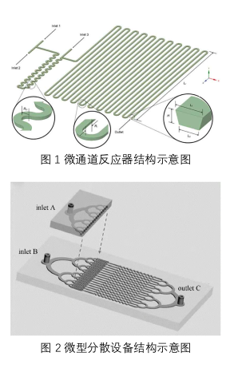

2023.04.25 TODO
1. 理解2015 Eqn 14在讲什么, 这个NSCH方程怎么像2020用上线性弹性体的知识来得到一个用于最小化的能量方程, 主要是存在SF项的情况下怎么与线性弹性体方程形成类比 (得去看看 Kim 2009来理解SF项)

2. 把2020 Eqn 20中的能量密度$\Psi$换成2015 Eqn 13的$\mu$, 或者也不一定能简单替换, 但要在最小化的能量方程中同时出现速度场$\boldsymbol{v}$和体积分数$c$ (这会导致的问题是求解矩阵不对称因而没法满足KKT条件, 无法求解? 这需要进一步学习), 每个cell有$\boldsymbol{v}, c$. 
   在实际问题中我们的算法大致是这样工作的: 
   - 指定inlet, outlet处的$\boldsymbol{v}$和各流体体积分布$c$, 指定Stokes流体的混合程度系数 (假定为$\kappa$, 这个系数用于 2015 Eqn 12中的$F(c)$项中? )
   - 模型会根据需要最小化的能量函数$E[\boldsymbol{v}, c]$对每个cell遍历, 与outlet的$\boldsymbol{v}, c$对比, 得到损失函数, 反向传播, 更新拓扑结构
   
3. 但是我忽然有一个问题, 在现实中的什么情况下需要: 输入两个Stokes流, 指定它们的输入与输出速度与体积分数, 然后目的是得到最优的拓扑结构呢? 工业上那种inlet是微米级的混合管, 目的也是为了得到目标混合流体的输出速度与体积分数 (比如混合管的目标是让两种流体充分混合, 体积分数$c=[0.5, 0.5]$), 而不是最优拓扑结构啊, 这么长长一根显然不是最优拓扑结构:

   
