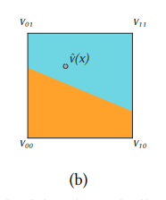

标题: Functional Optimization of Fluidic Devices with Differentiable Stokes Flow (2020)

论文实现的东西: 工程师在较高层面上为fluid-solid边界指定参数化的表面（in NURBS form) 以及inlet和outlet flow的属性, 论文在规定条件下为流体装置给出具体的边界参数设定, 用Stokes flow测试设计结果. 

Stokes流假设: 速度很小并且vsicosity相对很大（雷诺数$Re\ll1$) 

前人的拓扑优化生成boundary的工作只限制在no-slip boundary上

文章提出“基于样条的参数化边界”, 可以比基于体素的参数化更低维（更灵活) 

## 偏微分方程

定义边界为$\Gamma$, $\Omega\sub \mathcal R^d(d=2\ \text{or}\ 3)$是被边界包裹的流体域, 那么速度域可以写成$\boldsymbol v:\Omega\to \mathcal R^d$ ($\Omega$在文章中统一表示流体域/固体域), 流体域可以写成$p:\Omega\to\mathcal R$. 那么要求解的偏微分方程和不可压缩条件就可以写成
$$
\begin{align}
-\eta\Delta \boldsymbol v(x) + \nabla p (x) &= f(x) &x\in\Omega\\
\nabla\cdot \boldsymbol v(x)&=0 &x\in\Omega
\end{align}
$$
其中$\eta$是dynamic viscosity, $f(\boldsymbol x)$是外力作用域（比如重力域) . 接下来讲了讲Eqn 1是由动量方程$\nabla\cdot T(\boldsymbol x) + f(\boldsymbol x) = 0$（这个方程是怎么来的? ) 推导而来的, 应力张量(stress tensor) $T$为
$$
\begin{align}
\boldsymbol D&=\dfrac{1}{2}[\nabla\boldsymbol  v + (\nabla\boldsymbol  v)^\top]\\
\boldsymbol T&=2\eta\boldsymbol  D - p\boldsymbol  I = \eta[\nabla\boldsymbol  v + (\nabla\boldsymbol  v)^\top] - p\boldsymbol I
\end{align}
$$
其中$\boldsymbol D$为应变率张量(strain rate tensor), $I$为$d\times d$单位矩阵. 把Eqn 4代入动量方程即得Eqn 1.

边界条件: 

- Dirichlet boundary conditions: 
  $$
  \boldsymbol v(x) = \boldsymbol \alpha(x) ,\ x\in\Gamma_D
  $$
  $\Gamma_D$边界为流体指定一个确定的速度域$\alpha(\boldsymbol x)$, 比如在inlet处

- no-slipzero-Dirichlet boundary condition:
  $$
  \boldsymbol v(x) = \boldsymbol 0
  $$
  速度为零的Dirichlet边界, 模型中少数情况会用到

- traction condition:

  定义牵引力向量$\boldsymbol \tau(\boldsymbol x) = \boldsymbol T(\boldsymbol x)\cdot\boldsymbol  n(\boldsymbol x)$, 则牵引力条件为
  $$
  \boldsymbol \tau(x) = \boldsymbol \beta(x),\ x\in\Gamma_T
  $$
  一般在outlet处使用, 不是指定边界的速度域, 而是指定边界的外力域$\beta(\boldsymbol x)$, 比如在出口加一个可渗透的薄膜增大阻力

- open boundary condition:
  $$
  \boldsymbol \tau(x) = \boldsymbol 0
  $$
  开放边界条件, 边界不提供外力阻碍或加速流体流动

- no-separation(and, in essence also no-friction) boundary condition:
  $$
  \begin{align}
  \boldsymbol v(x)\cdot\boldsymbol  n(x) &= 0,\ x\in\Gamma_S\\
  \boldsymbol \tau_t(x) &= 0,\ x\in\Gamma_S
  \end{align}
  $$
  其中$\tau_t$表示tangential component of traction vector, 维度为$(d-1)$, 因为是把边界的traction vector投影到切向所以维度减一. Eqn 9 意味着流体对容器边界没有法向速度, 与容器既不分离也不渗透（因此叫no-separation) ；Eqn 10意味着容器边界对流体没有切向摩擦力. 这一边界用来表示wall, 使用很广泛, 且Eqn 9和Eqn 10结合后在每个boundary point产生的方程数量与其它类型的boundary point产生的方程数量相同, 都是$d$ (dimension) 个. 

Stokes流与不可压缩线性弹性体 (incompressible linear elasticity) 有类似关系, 它们的PDF都来自于守恒方程, 然后Stokes流的PDE基于速度场定义, 弹性体的PDE基于位移场定义. 

首先是标准（即可压缩) 线性弹性体 (standard linear elasticity) 的PDE, 定义deformation map $x(\boldsymbol x):\Omega\to\mathcal R^d$, 其中$X$是材料形变前的坐标, $x$是空间/形变后的坐标, 于是可以定义 displacement filed $\boldsymbol u(\boldsymbol x) = x(\boldsymbol x) - X$, 并且定义small-strain tensor $\epsilon$和Cauchy stress $\sigma$:
$$
\begin{align}
\epsilon = \dfrac{1}{2}[\nabla\boldsymbol u + (\nabla\boldsymbol  u)^\top]\\
\sigma = 2\mu\epsilon + \lambda \tr(\epsilon) I
\end{align}
$$
其中$\mu, \lambda$是弹性材料的Lame系数. 将$\sigma$代入到动量方程$\nabla\cdot \sigma(\boldsymbol x) + f(\boldsymbol x) = 0$ (其中$f(\boldsymbol x)$是合外力), 得到线性弹性体的PDE:
$$
-\mu\Delta\boldsymbol  u(x) - (\mu + \lambda)\nabla[\nabla\cdot \boldsymbol u(x)] = f(x), x \in \Omega
$$
对不可压缩材料, $\lambda \gg \mu, \lambda\to\infty$. 由于$\lambda$趋向于无限, 引入一个新的辅助状态变量$r(\boldsymbol x) = -(\mu+\lambda)\nabla\cdot \boldsymbol u(\boldsymbol x)$, 代入Eqn 13, 可以得到以下方程组:
$$
\begin{align}
-\mu\Delta\boldsymbol  u(x) + r(x)&= f(x), x \in \Omega\\
\nabla\cdot\boldsymbol u(x) + \dfrac{1}{\mu+\lambda}r(x) &= 0 ,x\in\Omega
\end{align}
$$
linear elasticity Eqns 14, 15与Stokes PDE Eqns 1, 2有相似之处: $\eta, \boldsymbol v, p$对应于$\mu, \boldsymbol u, r$; 当材料变得不可压缩时, $\lambda\to\infty$, Eqn 15就变成$\nabla\cdot\boldsymbol u(\boldsymbol x)= 0 ,x\in\Omega$, 与Eqn 2在形式上一模一样了. (但是Eqn 14, 15在接下来的求解过程中并不会用到, 只是为了证明两个问题在形式上的相似性. 接下来求解用的还是Eqn 13)

另外, Cauchy stress $\sigma$ of linear elasticity与stress tensor $T$ of Stokes在不可压缩条件下也可以进行类比, 由Eqn 11可以得
$$
\tr(\epsilon) = \nabla\cdot\boldsymbol u = -\dfrac{1}{\mu+\lambda}r
$$
于是将Eqn 11, 16代入Eqn 12, 有
$$
\sigma = \mu[\nabla\boldsymbol u + (\nabla\boldsymbol  u)^\top] -\dfrac{\lambda }{\mu+\lambda}r I
$$
另外定义Poisson’s ratio $\upsilon = \dfrac{\lambda}{2(\mu + \lambda)}$. 当弹性体不可压缩时, $\lambda\to\infty$, 有
$$
\sigma = \mu[\nabla\boldsymbol u + (\nabla\boldsymbol  u)^\top] -r I
$$
这与Eqn 4的形式完全相同, 因此由$\sigma$与$T$​确定的traction condition在两种情况下也是完全一样的, 其他三种边界条件由于不涉及材料的影响因此本来就是一样的, 因此Stokes与linear elasticity在不可压缩的情况下, PDEs和四种边界的表达式在形式上都是一样的.

[Zhu et al. 2010]. 讲了将在不可压缩限制下对Stokes peoblem进行离散化求解有它自己的缺点: 由于采用鞍点 (saddle point) 形式 (TO KNOW), 它会限制数值求解器的选择, 并且对于子元素精度 (sub-element precision) 的边界处理也不容易, 尤其是要保留离散化的某些数值特征 (如对称性) 的情况下.

因此本文在**准不可压缩**, 即$v\approx0.49$的条件下, 将线性弹性体与Stokes的PDE做类比, 得到Stokes的PDE. 将Poisson’s ratio $\upsilon$的定义 ($\mu+\lambda = \dfrac{\lambda}{2\upsilon} = \dfrac{\mu}{1-2\upsilon}$) 代入Eqn 13可以得
$$
-\eta\Delta\boldsymbol  v(x) - \dfrac{\eta}{1-2\upsilon}\nabla[\nabla\cdot \boldsymbol v(x)] = f(x), x \in \Omega
$$
其中把Eqn 13的$\mu, \boldsymbol u$换成$\eta, \boldsymbol v$​. 

将Eqn 11, 16和Poisson’s ratio $\upsilon$代入Eqn 12, 得到
$$
\boldsymbol T = \eta[\nabla\boldsymbol v + (\nabla\boldsymbol  v)^\top] +\eta(\dfrac{2\upsilon }{1-2\upsilon}\nabla\cdot\boldsymbol v )I
$$
其中把Eqn 12的$\sigma, \boldsymbol u, \mu$换为$\boldsymbol T, \boldsymbol v, \eta$.

Poisson’s ratio $\upsilon$表示不可压缩性, $\upsilon\to0.5$时Eqn 19, 20变为Eqn 1, 2, 4. 如果用the saddle point formulation离散化完全不可压缩Stokes flow, 则需要用iterative sparse linear solver (迭代稀疏线性求解器), 比如 Preconditioned Conjugate Gradient (PCG) or multigrid methods. 但是本文用的是quasi-incompressible formulation (准不可压缩表示), 所以可以用direct sparse solvers (直接稀疏求解器), 它相对于iterative solver的优势在梯度计算的时候会很明显.

总结: Eqn 19与Eqn13在形式上是一样的, 因此可以在计算Stokes flow的速度时复用线性弹性体的知识; Eqn 20与Eqn 12在形式上是一样的, 即Stokes flow与线性弹性体的应力张量是一样的, 因此再计算Stokes flow的边界时可以复用线性弹性体的知识 (由应力张量决定的traction boundary一样, 另外三种boundary本来就一样).

## 数值离散化

为什么 quasi-incompressible Stokes fluid 就不用在PDE (Eqn 19) 中考虑“压强”变量了呢?

接下来是对PDE的各种离散化, 使其能成为用数值方法求解的最优化问题. 

- 首先是在traction boundary处的离散化

  此边界的PDE方程原本是:
  $$
  \begin{align}
  -\eta\Delta\boldsymbol  v(\boldsymbol x) - \dfrac{\eta}{1-2\upsilon}\nabla[\nabla\cdot \boldsymbol v(\boldsymbol x)]& = f(\boldsymbol x), \boldsymbol x \in \Omega\\
  \boldsymbol T\cdot \boldsymbol n&=\boldsymbol \beta(\boldsymbol x), \boldsymbol x\in\part\Omega
  \end{align}
  $$
  其中$\Omega\in\mathcal R^d$表示流体域, $\part \Omega$表示流体域的边界. 根据 [Dauxet al.2000; Hughes 2012] 这种问题可以变为求解在某一solution space中关于$v$的最小化能量$E[v]$, 我们定义solution space是所有笛卡尔网格单元上通过bilinear或trilinear定义的函数 (?), 也就是最小化
  $$
  E[\boldsymbol v] = \int_\Omega\Psi[\boldsymbol v(\boldsymbol x)]\mathrm d\boldsymbol x - \int_\Omega(\boldsymbol v\cdot\boldsymbol  f)\mathrm d \boldsymbol x - \int_{\part\Omega}(\boldsymbol v\cdot \boldsymbol \beta)\mathrm d \boldsymbol S
  $$
  其中的能量密度$\Psi[\boldsymbol v]$为
  $$
  \Psi[\boldsymbol v] = \eta\Vert\boldsymbol D[\boldsymbol v]\Vert_F^2 + \dfrac{\eta \upsilon}{1-2\upsilon}[\tr(\boldsymbol D[\boldsymbol v])]^2
  $$
  应变率张量 (strain rate tensor) $\boldsymbol D$来自Eqn 3. $\boldsymbol f$为外力(重力), 大部分情况下忽略, $\boldsymbol f = 0$; 由于traction boundary的条件, $\boldsymbol \beta = 0$. 因此在traction boundary处的$E[\boldsymbol v]$就第一项. 就算在不能忽略后两项的条件下, 它们也可以很轻松地在离散化的过程中被包括进来.

- Sub-cell的能量积分

  solution space包含所有如下形式的函数
  $$
  \boldsymbol {\hat v}(\boldsymbol x;\mathcal V) = \sum\limits_i\boldsymbol v_i\mathcal N_i(\boldsymbol x)
  $$
  \hat在文中的意思应该是“由nodal velocity线性组合计算得到的结果”. 其中$\mathcal N_i(\boldsymbol x)$是grid node $i$的形状函数 (相当于是通过$\mathcal N_i(\boldsymbol x)$给每个nodal velocity一个权重? ), $\mathcal V = \{\boldsymbol v_i\}$表示所有nodal velocities.  一个gird的速度由nodal velocities经过bilinear/trilinear插值得到, 如下所示: 

  

  根据Eqn 25, 可以将所有derivatibe quantities用nodal velocities表示, 比如strain rate tensor:
  $$
  \boldsymbol D=\dfrac{1}{2}[\nabla\boldsymbol  v + (\nabla\boldsymbol  v)^\top]\\
  \hat {\boldsymbol D}_{pq}= \dfrac{1}{2}\sum\limits_i\left[\boldsymbol v^{(p)}_i\mathcal N_{i, q}(\boldsymbol x) + \boldsymbol v^{(q)}_i\mathcal N_{i, p}(\boldsymbol x) \right]
  $$
  其中上标$(p), (q)$表示nodal velocity $\boldsymbol v_i$的方向分量, 下标$p, q$表示$\boldsymbol D, \mathcal N$的partial derivatives.
  
  $\Psi$依赖于$\boldsymbol D[\boldsymbol v]$, 而$\dfrac{\part \boldsymbol D[\boldsymbol v]}{\part p\part q} = \hat {\boldsymbol D}_{pq}$可以用nodal velocity set $\mathcal V$表示, 因此Eqn 23的$E[\boldsymbol v]$也就可以用nodal velocities表示, 这样它的derivative就是可以用$\mathcal V$计算的:
  $$
  E[\mathcal V] = \int_\Omega\Psi[\hat {\boldsymbol v(\boldsymbol x; \mathcal V)}]\;\mathrm dx = \sum\limits_k\int_{\Omega\cap\mathcal C_k}\Psi[\hat {\boldsymbol v(\boldsymbol x; \mathcal V)}]\;\mathrm dx
  $$
  设$E_k[\mathcal V] = \int_{\Omega\cap\mathcal C_k}\Psi[\hat {\boldsymbol v(\boldsymbol x; \mathcal V)}]\;\mathrm dx$, (到论文的Eqn 23为止)
  
  

## Read further

[Bridson 2015], Fluid Simulation for Computer Graphics, 二百多页的书

[Lautrup 2004], Physics of Continuous Matter: Exotic and Everyday Phenomena in the Macroscopic World, 是本书, 知道后不想看了
