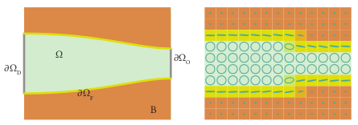
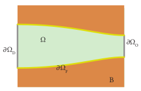
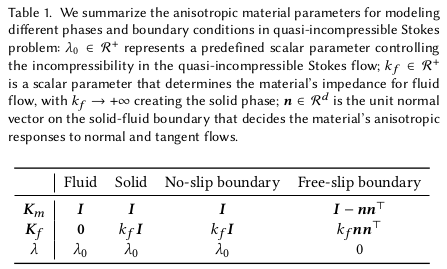
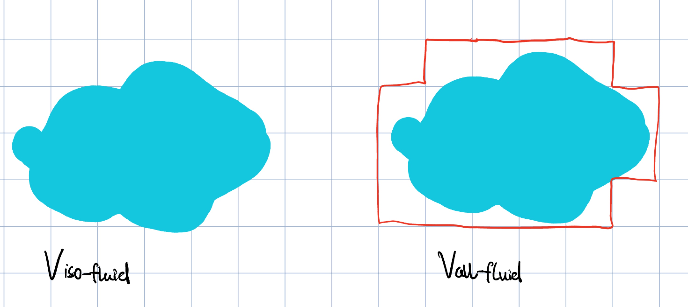
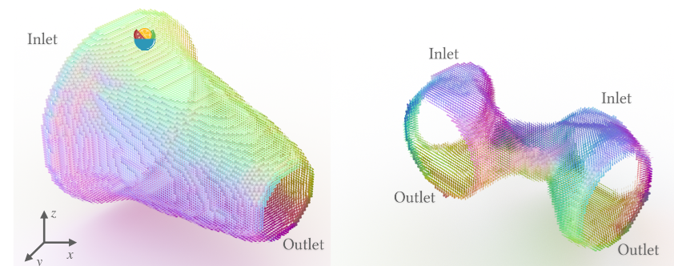
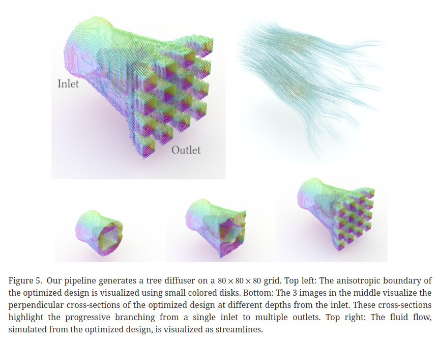
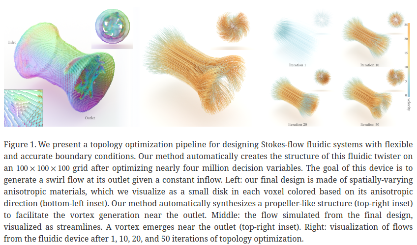
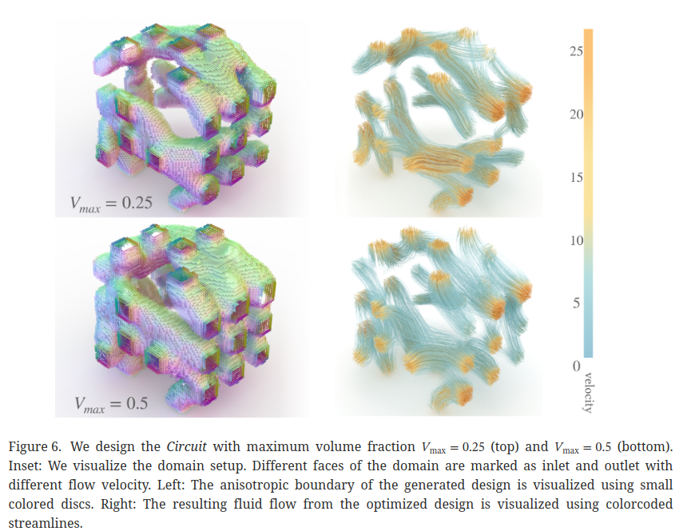
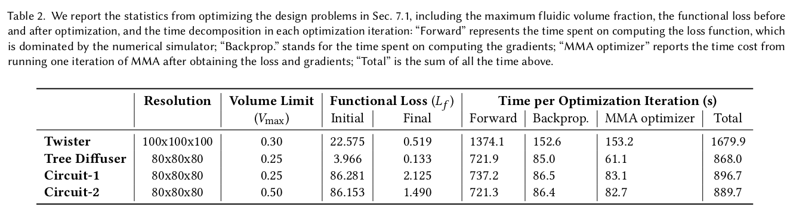

标题：Fluidic Topology Optimization with an Anisotropic Mixture Model (2022)

对于各向同性与各向异性的理解：我觉得这篇文章里的各向异性的意思就是，对于一个cell，有fluid从不同方向流向它，如果它对不同方向的fluid的处理方式不同，则是各向异性的。比如free-slip边界是各向异性的，因为它对流的法向速度与切向速度处理不同；而fluid-phase, solid-phase和no-slip边界都是各向同性的，因为它们对从各个方向的流向它们的流处理方式是相同的。

整篇文章的大意就是给定inlet $\part \Omega_D$, outlet $\part\Omega_O$, fluid region $\Omega$和整个axis-aligned的空间$\mathcal B$，模型自动生成空间内每个体素的参数：

N-S方程：
$$
\rho\dfrac{\mathrm D \boldsymbol v}{\mathrm D t} =\rho(\dfrac{\part \boldsymbol v}{\part t} + \boldsymbol v\cdot \nabla \boldsymbol v)  = \mu\nabla^2\boldsymbol v - \nabla p^*
$$
其中$p^*$为测压管压强，$p^* = p + \rho gz$，求导得$\nabla p^* = \nabla p - \rho\boldsymbol{g}$.

斯托克斯流：粘性力远大于惯性力的流，雷诺数远大于1，惯性力可被忽略，可以理解为粘性非常强，几乎不会动，于是对流项$\boldsymbol v\cdot \nabla \boldsymbol v$被忽略，N-S方程变为
$$
\rho\dfrac{\part \boldsymbol v}{\part t}+ \nabla p^* = \mu\nabla^2\upsilon
$$
如果考虑定常状态，即时变项也为0，得到
$$
\nabla p^* = \mu\nabla^2\upsilon
$$
此时（测压管）压强与粘性作用近似抵消（二者都比惯性项显著的多），可以认为合外力为0，该流体处于平衡状态，这种流动状态称为蠕动流或斯托克斯流。

## 各向同性斯托克斯方程

首先作者给出各向同性准不可压缩的斯托克斯流（我真应该去看看Du 2020）下的约束速度场的公式：
$$
\min\limits_{\boldsymbol v}\int_\Omega \mu\Vert \nabla\boldsymbol v\Vert ^2_F\;\mathrm dx + \int_\Omega \lambda(\nabla\cdot\boldsymbol v)^2\;\mathrm dx,\\
\begin{align*}
     \text{ s.t.}\  &\boldsymbol v(\boldsymbol x) = \boldsymbol v_D(\boldsymbol x),\forall \boldsymbol x\in\part\Omega_D.\\
    &\boldsymbol v(\boldsymbol x) \cdot\boldsymbol n(\boldsymbol x) = 0,\forall \boldsymbol x\in\part\Omega_F.\\
\end{align*}
$$

- $\Omega$代表**流体存在的区域**，$\Omega\subset \R^d(d=2,3)$
- $\mu$代表动力粘度（Dynamic viscosity，Pa\*s或N\*s/m^2），$\lambda$代表不可压缩程度，$\lambda\to+\infin$代表不可压缩的斯托克斯流
- $\Vert\cdot\Vert_F$代表矩阵的Frobenius norm, $\Vert A\Vert_F = \sqrt{\sum\limits_i\sum\limits_j|a_{ij}|^2} = \sqrt{\text{trace}(A\cdot A)}$，在向量上就是向量的L2范数
- $\part\Omega$代表定义在域边界的边界条件，$\part\Omega = \part\Omega_D\cup\part\Omega_F\cup\part\Omega_O$，分别代表：
  - Dirichlet边界，此边界将流体速度指定为一个速度$\boldsymbol v_D$，要么是在入口指定为入口速度，要么是在no-slip边界指定为$\boldsymbol v_D$.
  - Free-slip边界，要求流体速度沿边界法向的投影为0
  - Open边界，不对速度作出限制，自动满足0牵引力条件（这应该是在Du 2020中讲的？），一般是适合建模在自由流体的出口处
- Du 2020是提出了这一在准不可压缩斯托克斯流动模型及装置设计问题中有数值优势的方程，并提出了流体装置的计算设计管线，但它们的方法是被参数空间限制的。
- $\nabla\cdot\boldsymbol v$速度的散度，同流体力学不可压缩方程中的那项。$\nabla\boldsymbol v$代表什么我应该去看看Du 2020

## 各向异性斯托克斯方程

各向异性、准不可压缩斯托克斯流体的能量最小化方程：
$$
\min\limits_{\boldsymbol v} E_{m,\mu}[\boldsymbol v] + E_{m,\lambda}[\boldsymbol v] + E_{f}[\boldsymbol v],\\
\text{s.t.}\ \boldsymbol v(\boldsymbol x) = \boldsymbol v_D(\boldsymbol x),\forall \boldsymbol x\in\part\mathcal B_D.
$$
where
$$
\begin{align}
E_{m,\mu}[\boldsymbol v] &:= \int_\mathcal B\mu\Vert \nabla \boldsymbol v\boldsymbol K^{\frac{1}{2}}_m(\boldsymbol x)\Vert ^2_F\mathrm dx\\
E_{m,\lambda}[\boldsymbol v] &:= \int_\mathcal B\lambda(\boldsymbol x)(\nabla\cdot \boldsymbol v)^2\mathrm dx\\
E_{f}[\boldsymbol v] &:= \int_\mathcal B\Vert \boldsymbol K^{\frac{1}{2}}_f(\boldsymbol x)\Vert ^2_2\mathrm dx
\end{align}
$$

- $m,f$建模material（表示phase在某点是各向同性 or 各向异性）和frictional（表示phase在某点受到的外摩擦力）的影响

- $\boldsymbol K_m = \boldsymbol I, \boldsymbol K_f = \boldsymbol 0$时方程退化为各向同性下的方程

- 首先将流体域$\Omega$改成了axis-aligned，足够大的，包含$\Omega$的box $\mathcal B\subset\R^d(d=2,3)$，两者的不同是，$\Omega$只包含流体域，而$\mathcal B$包含流体域+固体域（注意下图中的$\Omega$和$\mathcal B$）：

  

- 引入代表material和frictional影响的两个对称半正定矩阵$\boldsymbol K_m,\boldsymbol K_f:\mathcal B\to S^d_+$, （这个式子的意思应该是，$\boldsymbol K_m,\boldsymbol K_f$接收一个$\mathcal B$中的坐标$x$，然后返回该$x$下的材料、摩擦性质，返回的是一个$d\times d$半正定矩阵，因此用$S^d_+$表示）

  - 对称：$A_{ij} = A_{ji}$
  - 半正定（Positive Semi-Definite）：对于任意非零向量 $x$，都有$x^TAx \geq 0$，特点：
    - 所有的特征值都非负。
    - 对应于非零特征值的特征向量线性无关。
    - 可以作为各种优化问题的约束条件，尤其是在凸优化领域中。
    - 在统计学中，协方差矩阵是对称正半定矩阵的一个例子，因为协方差矩阵描述了各个随机变量之间的相关性。

- 将$\lambda$换为空间分布的域而非常数，$\lambda:\mathcal B\to\R^+$，接收与$\mathcal B$同维度的$x$返回一个正数

- 引入$\boldsymbol K_m,\boldsymbol K_f, \lambda$使得新材料的模型可以对不同方向的速度作出各向异性的回复，比如通过设置$\boldsymbol K_m$就可以使得与该cell接触的fluid的法向速度变为0

- 边界划分（边界为什么是$\mathcal B$的偏导？partition是“划分”的意思，指的是将边界分割成若干互不重叠的部分）：$\part\mathcal B = \part\mathcal B_D\cup\part\mathcal B_O$

  - Dirichllet：用在流体系统的进口（$v_D$被设置为规定值）和固体项的边界（$v_D = 0$）
  - Open：如前，模拟零牵引力，用在自由流体的出口
  - 现在只有两种边界（与$\part\Omega = \part\Omega_D\cup\part\Omega_F\cup\part\Omega_O$相比少了free-slip边界）并不是取消了solid-fluid边界上no-slip和free-slip条件，而是将其的表示纳入到$\boldsymbol K_m,\boldsymbol K_f, \lambda$的选择中

$\mathcal B$中的每个格子（或体素）有$\boldsymbol K_m,\boldsymbol K_f, \lambda$，精心选择它们就可以表示solid, fluid相和no-slip, free-slip边界。

- Fluid-phase material：$\boldsymbol K_m = \boldsymbol I,\boldsymbol K_f = \boldsymbol 0, \lambda = \lambda_0$，表示在流体域$\Omega$内流体受到的外摩擦力为0，此时方程变为各向同性斯托克斯方程

- Solid-phase material：$\boldsymbol K_m = \boldsymbol I,\boldsymbol K_f = k_f \boldsymbol I \ \text{where} \ k_f\to+\infty, \lambda = \lambda_0$，根据方程（4），此时solid-phase内部的$v$只能取0。$\boldsymbol K_m ,\lambda $的取值此时对solid内部的$v$的结果没有影响，但建议这么取，得到一个各向同性、准不可压缩的solid material

- No-slip-boundary material：$\boldsymbol K_m = \boldsymbol I,\boldsymbol K_f = k_f\boldsymbol I\ \text{where} \ k_f\to+\infty, \lambda = \lambda_0$，不允许滑移边界让流体速度为0，所以参数选择上同solid-phase

- Free-slip-boundary material：假设表面处法向量为$\boldsymbol n$，以此作为单位向量定义一组单位正交基$\boldsymbol R :=(\boldsymbol n,\boldsymbol t_1,\boldsymbol t_2)_{3\times3}$，然后就可以对$\nabla v$做关于$\boldsymbol R$的旋转：
  $$
  v_{\boldsymbol R} := \boldsymbol R^\top v ,\\
  x_{\boldsymbol R} := \boldsymbol R^\top x ,\\
  \nabla_{x_{\boldsymbol R}}v_{\boldsymbol R} := {\boldsymbol R}^\top\nabla v {\boldsymbol R}
  $$
  最后一项大概就是$\nabla_{x_{\boldsymbol R}}v_{\boldsymbol R} = \nabla_{\boldsymbol R^\top x}\boldsymbol R^\top v$的结果，具体计算先忽略了

  $(\cdot)_{\boldsymbol R}$表示定义在被${\boldsymbol R}$旋转的local frame（局部坐标系）下的量，因此$\nabla_{x_{\boldsymbol R}}v_{\boldsymbol R}$的第一行（first row）就表示流在法向的空间梯度大小。

  于是free-slip消除法向速度的条件就可以转化为使速度在被$\boldsymbol R$旋转后的坐标系中沿法向的梯度为0，切向速度不变（这块还需要理解一下，为什么由各向同性下的“法向速度为0”变成了“速度的法向梯度为0”？），$E_{m,\mu}[v]$的被积函数为：
  $$
  \begin{align}
  \Psi_{m,\mu}&:=\mu\Vert \nabla_{x_{\boldsymbol R}}v_{\boldsymbol R}\boldsymbol \Lambda (0, 1, 1)\Vert _F^2\\
  &:=\mu\Vert \nabla v(\boldsymbol I - \boldsymbol n \boldsymbol n^\top)^{\frac{1}{2}}\Vert _F^2
  \end{align}
  $$
  其中$\Lambda (0, 1, 1)$表示对角矩阵，化简过程略了，对比（5）式可得现在的$\boldsymbol K_m$应取$\boldsymbol I - \boldsymbol n \boldsymbol n^\top$

  类似地，取$\boldsymbol K_f = \boldsymbol R \boldsymbol \Lambda(k_f,0,0)\boldsymbol R^\top = k_f\boldsymbol n \boldsymbol n^\top,\ \text{where}\ k_f\to+\infty$可以将$v$转到以$\boldsymbol R$为基底的局部坐标系，并且使得法向流为0切向流完整。

  取$\lambda = 0$，如果$\lambda>0$则在free-slip边界会有不可压缩性，而一个solid-fluid mixed cell有不可压缩性就会保留流体，这与自由滑移相悖。同时，不可压缩性是为了解决流体泄漏的问题，但在free-slip边界通过设置法向速度为0已经让液体不会泄漏了。

总结：

## 数值模拟

$v$设置在grid nodes上并使用线形插值（但在太极图形学的欧拉视角下$v$是设置在grid两个node的中间而不是node上，虽然这也没区别吧就是），$\boldsymbol K_m,\boldsymbol K_f, \lambda$是每个cell中心存一个constant value。

本来要用一个对称正定stiffness matrix（刚度矩阵）描述$\boldsymbol K_m,\boldsymbol K_f$，但是可以用自由度更少的方式来描述：

- fluidity $\rho:\mathcal B\to[0, 1]$，流体性，1代表纯流体
- isotropy $\epsilon: \mathcal B\to[0,1]$，各向同性，更大代表更接近各向同性材料
- anisotropic orientation $\boldsymbol\alpha : \mathcal B\to\R^{d-1}$，2D下的旋转角$\alpha$，3D下的球坐标$(\theta,\phi)$
- unit normal $\boldsymbol n : \mathcal B\to\R^d$，由$\boldsymbol\alpha$引出的单位法向量

用如下方程构建$\boldsymbol K_m$：
$$
\boldsymbol K_m = \boldsymbol I - (1-\epsilon)\rho\boldsymbol n\boldsymbol n^\top
$$

- $\epsilon = 1$（各向同性材质）or $\rho = 0$（纯固体）使得$\boldsymbol K_m  = \boldsymbol I$，也即cell为各向同性
- $\epsilon = 0$ and $\rho = 1$表示cell既有纯流体的流动性又没有各向同性，使得$\boldsymbol K_m = \boldsymbol I - \boldsymbol n \boldsymbol n^\top$，表示free-slip边界

用如下方程构建$\boldsymbol K_f$：
$$
\boldsymbol K_f = k_f(\rho) \boldsymbol I + (k_f(\epsilon\rho) - k_f(\rho))\boldsymbol n\boldsymbol n^\top,\\
\text{where}\ k_f(\rho) = k_{f_{\max}} + (k_{f_{\min}} - k_{f_{\max}})\rho\dfrac{1+q}{1-q}
$$
$k_{f_{\max}}\approx0, k_{f_{\min}}\approx1e5$表示$k_f$的范围，$q = 0.1$控制映射的尖锐度：更小的$q$使得$k_f$在映射时更倾向于极值。较小的$\rho$（solid phase）将$k_f$映射向$k_{f_{\max}}$，较大的$\rho$（fluid phase）将$k_f$映射向$k_{f_{\min}}$

- $\epsilon = 1, \rho = 1$，各向同性纯流体，则$k_f(\epsilon\rho) = k_f(\rho) = 0$，$\boldsymbol K_f = \boldsymbol 0$
- $\epsilon = 1, \rho = 0$，各向同性纯固体，也可以表示no-slip边界，则$k_f(\epsilon\rho) = k_{f}(\rho) = k_{f_{\max}}$，$\boldsymbol K_f = k_{f_{\max}}\boldsymbol I$
- $\epsilon = 0, \rho = 1$，各向异性纯流体，表示free-slip边界，则$k_f(\epsilon\rho) =  k_{f_{\max}}, k_{f}(\rho) = 0$ ，$\boldsymbol K_f = k_{f_{\max}}\boldsymbol n\boldsymbol n^\top$

用如下方程构建$\lambda$：
$$
\lambda = \lambda _\min + [1-(1-\epsilon)\rho]^p\lambda _\max
$$
$\lambda_\min = 0.1,\lambda_\max = 1e3$表示$\lambda$的范围，$p=12$把$\lambda$的选择推向极值，要么是$\lambda_\min$要么是$\lambda_\min + \lambda_\max$

- $\epsilon = 1$ or $\rho = 0$使得$\lambda = \lambda_\max$，cell有不可压缩性
- $\epsilon = 0$ and $\rho = 1$使得$\lambda = \lambda_\min$，cell可压缩，表示free-slip边界

## 离散化

首先是material parameters的离散化，对于每个cell中心放着的$\rho,\epsilon,\boldsymbol\alpha$（其中$\boldsymbol\alpha$是用来导出$\boldsymbol n$的），简记为：
$$
\boldsymbol\theta:=\{\rho,\epsilon,\boldsymbol\alpha\}
$$
然后是fluid velocity的离散化，放在grid nodes处，要用到时用线性插值即可

接下来是公式（4）中每项能量项的离散化，不同项用不同的方式：

- $E_{m,\mu}$是每个cell的各向异性拉普拉斯项，如Du 2020中所做的那样，我们用Gaussian-Legendre积分规则来计算这一项，2D下用4个积分点，3D下用8个积分点

- $E_{m, \lambda}$是每个cell的divergence项，$\lambda > 0$则说明该cell会保留流体体积。我们用如下的表达式近似它：
  $$
  E^C_{m, \lambda}\approx\lambda_CW_C\left[\frac{1}{W_C}\int_C(\nabla\cdot v)\mathrm d x\right]^2
  $$
  $W_C$是cell $C$的体积（$h^2$ in 2D, $h^3$ in 3D），这不会保证cell内部每个点都是零散度，但可以保证cell整体的散度（积分后变通量）$\text{Flux(C)} = \int_C(\nabla\cdot v)\mathrm dx$倾向于0，并且积分结果是可以直接用速度表示的，在2D中假设cell的速度为$\boldsymbol v = (u,v)$，则有
  $$
  \text{Flux}(C) = h(\dfrac{u_{10} + u_{11}}{2} + \dfrac{v_{01} + v_{11}}{2} - \dfrac{u_{00} + u_{01}}{2} - \dfrac{v_{00} + v_{10}}{2})
  $$
  下标表示cell的四个角上的速度。这个公式很好理解，就是拿四个顶点的$(u,v)$插值算出四条边上的$(u,v)$，再乘以$h$就可以得到面积变化，也即通量变化。扩展到3D上就是拿八个顶点的$(u,v,w)$算出六个面上的$(u,v,w)$，再乘以$h^2$

- $E_f$在离散化的时候用cell顶点的速度作为积分点，即
  $$
  E_f^C\approx\dfrac{W_C}{2^d}\sum\limits_I\Vert\boldsymbol K_f^{\frac{1}{2}}(C)v_I\Vert_2^2
  $$
  其中$d$ is dimension, index $I$遍历cell的顶点（4 in 2D, 8 in 3D），用顶点速度和$\boldsymbol K_f$近似出该点对外的摩擦力

于是能量最小化方程转化为下面的二次积分问题：
$$
\min\limits_{\boldsymbol v} \boldsymbol v^\top\boldsymbol K(\boldsymbol \theta)\boldsymbol v - \boldsymbol b(\boldsymbol \theta)^\top\boldsymbol v\\
\text{s. t. }\boldsymbol v_i = (\boldsymbol v_D)_i,\ \forall(i, (\boldsymbol v_D)_i)\in\mathcal D.
$$
其中$\boldsymbol v$堆叠了所有速度自由度，$\boldsymbol K, \boldsymbol b$是所有cell的材料参数的对称正定（SPD）刚性矩阵和向量的堆叠表示，$\mathcal D$是Dirichlet边界

## Gaussian-Legendre积分法则

[勒让德多项式](https://en.wikipedia.org/wiki/Legendre_polynomials)是一簇定义在$[-1,1]$去见上的正交多项式，可递归定义为
$$
\begin{aligned}
P_0(x) &= 1 \\
P_1(x) &= x \\
&\cdots\\
(n+1)P_{n+1}(x) &= (2n+1)xP_n(x) - nP_{n-1}(x)
\end{aligned}
$$
其中,$n$是多项式的阶数。勒让德多项式具有以下性质: 

1. 正交性：在区间$[-1,1]$上,任意两个不同阶的勒让德多项式$P_m(x)$和$P_n(x)$满足正交关系,即积分为0: 
   $$
   \int_{-1}^1 P_m(x)P_n(x)dx = 0, \quad (m \neq n)
   $$

2. 导数关系：勒让德多项式的导数可以用低阶勒让德多项式的线性组合表示: 
   $$
   P^\prime_n(x) = \frac{n}{2n+1}P_{n+1}(x) + \frac{n+1}{2n+1}P_{n-1}(x)
   $$

通过勒让德多项式的正交性质，我们可以构造[Gaussian-Legendre quadrature rule](https://en.wikipedia.org/wiki/Gauss%E2%80%93Legendre_quadrature)，将定积分近似为节点和对应权重的有限和：
$$
\int_{-1}^1 f(x)dx \approx \sum_{i=1}^n w_i f(x_i)
$$
其中，$x_i$是$P_n(x)$的第$i$个根，$w_i$的形式如下：
$$
w_i = \dfrac{2}{(1-x_i^2)[P^\prime_n(x_i)]^2}
$$

## block divergence限制

首先讲了讲用moderately-high values for $\lambda, k_f$的好处与坏处，好处是不会有两个相邻但法向不同的cell因为极高的$k_f$使进入两者之间的流体无法动弹；坏处是加剧泄漏。对于后者作者想的办法是在large block（包含4个或8个cell, in 2D or 3D）的层面上增加绝对体积保留的硬限制，然后做消融实验对比加不加这个限制的结果。

把$\mathcal B$分为large blocks (indexed by b)，添加如下block净流量限制：
$$
0 = \text{Flux}(\mathcal B_b) = \sum\limits_{C\in\mathcal B_b}\text{Flux}(C)
$$
它整体结果是线性限制，因为考虑block的所有面的净流量为0，最后也就成为加法，因此可以将限制写成$Cv = 0$.

所以问题就变成了在二次最优化问题$\min\limits_{\boldsymbol v} \boldsymbol v^\top\boldsymbol K(\boldsymbol \theta)\boldsymbol v - \boldsymbol b(\boldsymbol \theta)^\top\boldsymbol v$的基础上加一个线性限制。

接下来使用Karush-Kuhn-Tucker条件求解这个带有限制的优化问题，得到的方程组为：
$$
\left(
\begin{matrix}
2\boldsymbol K(\boldsymbol\theta) &  C^\top\\
C & 0
\end{matrix}
\right)
\left(
\begin{matrix}
v\\q
\end{matrix}
\right)
 = 
 \left(
\begin{matrix}
\boldsymbol b(\boldsymbol \theta)\\
0
\end{matrix}
\right)
$$
其中$q$是$Cv = 0$这一等式限制的拉格朗日乘子，然后使用direct factorization methods（直接因式分解法？具体方法见PARDISO [Alappat et al. 2020]这篇论文）解决这一对称正定问题。最后发现加上这个block divergence constraint（也就是加上$Cv=0$这个条件）是很有用的，实际中在3D中选取4\*4\*4个blocks（一个block又包含8个cell）作为一组加上hard block divergence constraint。最后整个section 4 and 5就是一个巨大的：
$$
v = F(\boldsymbol\theta)
$$

## Karush-Kuhn-Tucker条件

Karush-Kuhn-Tucker (KKT) 条件是解决约束优化问题的一组必要条件。这些条件在某些假设下也是充分条件。具体来说，对于一个优化问题，我们通常有一个目标函数 $f(x)$ 需要最小化（或最大化），同时受到一组不等式约束 $g_i(x) \leq 0$ 和等式约束 $h_j(x) = 0$ 的限制。KKT 条件为寻找这类问题的解提供了一种方法。 优化问题可以表述为： 
$$
\begin{align*} & \text{最小化} \quad f(x) \\ & \text{受到约束} \\ & \quad g_i(x) \leq 0, \quad i = 1, \ldots, m \\ & \quad h_j(x) = 0, \quad j = 1, \ldots, l \end{align*}
$$
KKT 条件包括以下几个部分： 

1. **可行性条件**：解必须满足所有的不等式和等式约束。
2. **梯度零条件（Stationarity）**：目标函数的梯度与约束函数梯度的线性组合必须为零。
3. **互补松弛条件（Complementary Slackness）**：对于每一个不等式约束，其乘子与约束函数的乘积必须为零。
4. **对偶可行性条件（Dual Feasibility）**：所有不等式约束的乘子必须非负。 

具体的 KKT 条件如下： 

1. 可行性条件：
   $$
   g_i(x) \leq 0, \quad i = 1, \ldots, m \\ h_j(x) = 0, \quad j = 1, \ldots, l
   $$

2. 梯度零条件（Stationarity）：

   构造拉格朗日函数
   $$
   L(x) = f(x) + \sum_{i=1}^{m} \lambda_i g_i(x) + \sum_{j=1}^{l} \mu_j h_j(x)
   $$
   其中，$\lambda_i$ 和 $\mu_j$ 分别是不等式和等式约束的拉格朗日乘子。求解$\nabla L(x) = 0$，即下式：
   $$
   \nabla f(x) + \sum_{i=1}^{m} \lambda_i \nabla g_i(x) + \sum_{j=1}^{l} \mu_j \nabla h_j(x) = 0
   $$
   就可以解得$\lambda_i$和$h_j$.

3. 互补松弛条件（Complementary Slackness）：
   $$
   \lambda_i g_i(x) = 0, \quad i = 1, \ldots, m\
   $$

4. 对偶可行性条件（Dual Feasibility）：
   $$
   \lambda_i \geq 0, \quad i = 1, \ldots, m
   $$

当优化问题满足一定的正则性条件时（比如Slater条件），KKT条件不仅是必要条件，也是充分条件。这意味着，对于某些优化问题，如果我们找到了满足KKT条件的点，那么这个点就是最优解。

## Optimization

现在，可以正式表示问题的形式，我们需要通过解决以下最优化问题来得到一个在给定inlet与outlet的速度参数的条件下最优的流体模型：
$$
\begin{align}
\min\limits_\theta\ \;&L_f(v) + w_cL_c(\boldsymbol \theta) + w_dL_d(\boldsymbol \theta) + w_aL_a(\boldsymbol \theta),\\
\text{s. t.}\ \ &v = F(\boldsymbol \theta),\\
& \boldsymbol \theta_\min\le\boldsymbol \theta\le\boldsymbol \theta_\max,\\
&0\le V_{\text{iso-fluid}} \le V_\max,\\
&0\le V_{\text{all-fluid}} \le V_b + V_\max.
\end{align}
$$

- $L_f$表示functional loss，一般取模拟得到的outlet flow与期望的outlet flow profile的（速度的？）$L_2$范数

- $L_c$：the compliance regularizer（柔顺度正则化项？反正是某种欧拉视角下的解决流体拓扑模型最优化问题的方法，详细见[Borrvall and Petersson 2003]），计算由于强制outlet flow profile与目标相同（通过引入额外的Dirichlet边界）而积累的弹性能量。我们为了使模拟的outlet flow profile到达目标outlet flow profile，会在出口处加入额外的Dirichlet限制，这会引入弹性能量。如果$L_c$越小说明我们需要额外加的Dirichlet条件越小，那么就说明模拟出的outlet flow profile与目标要求的越接近：
  $$
  L_c(\boldsymbol \theta) := v_c^\top\boldsymbol K(\boldsymbol \theta)v_c - \boldsymbol b(\boldsymbol \theta)^\top v_c,\\
  v_c = F(\boldsymbol \theta;\mathcal D\cup\mathcal D_O)
  $$
  其中$\mathcal D_O$就是为了是outlet flow profile达到目标而新增的Dirichlet边界

- $L_d$：the directional regularizer，方向性正则化项，它通过比较每个单元的各向异性方向与其小邻域的平均方向之间的余弦相似度，鼓励流体单元之间平滑过渡。定义阈值$\epsilon_0,\rho_0$（各向同性与流体性），如果cell $\epsilon < \epsilon_0 \ \text{and}\ \rho > \rho_0$，则认为cell是各向异性的。记$\mathcal A$为各向异性cell的集合：
  $$
  L_d:=\sum\limits_{c\in\mathcal A}1 - \psi_{\text{cos}}(\boldsymbol \alpha_c,\boldsymbol \alpha_{\text{nbr}})
  $$
  其中$\boldsymbol \alpha_c$是cell c的各向异性方向单位向量，$\boldsymbol \alpha_{\text{nbr}}$是它的邻居（3\*3\*3）的各向异性的平均方向，$\psi_{\text{cos}}$计算余弦相似度。最小化$L_d$鼓励free-slip边界流体方向的平滑性。

- $L_a$：the anisotropic regularizer，目的是减小solid-fluid边界处的各向同性（都是solid-fluid边界了那当然应该是各向异性的）：
  $$
  L_a(\epsilon) :=\sum_c\epsilon_c\rho_c(\rho_\max^{local} - \rho^{local}_\min)
  $$
  求和对模型内每个cell c进行。$\rho_\max^{local}, \rho^{local}_\min$是cell c周围3\*3\*3的邻居的最大和最小fluidity，如果cell c周围是solid-fluid边界，则会有较大的$\rho_\max^{local} - \rho^{local}_\min$，此时$\epsilon_c$就应该变得较小，表示此处是“各向异性”。

- 体积限制，$V_{\text{iso-fluid}}$表示流体域的总单位体积，也即各向同性（isotropy）流体的总单位体积，$V_{\text{all-fluid}}$表示流体域 + free-slip fluid-solid边界的总单位体积，它们的计算方式如下：
  $$
  V_{\text{iso-fluid}} :=\sum_c\epsilon_c\rho_c,\\
  V_{\text{all-fluid}} :=\sum_c\rho_c
  $$
  对于流体域的总体积，就是遍历每一个cell，因为“流体”既要求各向同性$\epsilon$，又要求流体性$\rho$，所以可以这么算，乘以$\epsilon_c$还有一个好处，对于fluid旁边的solid cell，或许也会有$\rho_c$，但会由于$\epsilon_c=0$而不加入这一部分solid的体积；对于流体域 + free-slip fluid-solid边界的总体积，不需要排除solid体积，故不用乘以$\epsilon$，我想$V_{\text{iso-fluid}}$和$V_{\text{all-fluid}}$想表达的体积大概如下图：

  

  后者就是前者的体积再加上它的边界。$V_\max$和$V_b$就是认为设置的两个参数，代表流体域体积的阈值和各向异性cell (也就是free-slip boundaries)的阈值。

这些正则化项是为了outlet flow在空间上分布平滑并且模型有清晰地solid-fluid边界。

## Numerical Optimizer

由于论文考虑了各向异性材料，引入各向异性参数，因此这个问题的数值优化问题比各向同性拓扑优化问题的参数空间更大。论文用method of moving asymptotes (MMA) [Svanberg 1987]优化算法，由于这个算法需要$\boldsymbol\theta$的梯度，所以作者扩展了Du et al. [2020]的可微分模拟器，可能这种可微分模拟器比在backpropagation中计算gradient更快？感觉作者是这个意思。另外作者引入了自适应的$\epsilon_c$上限：
$$
(\epsilon_c)_\max:=1 - (\rho^{local}_\max - \rho^{local}_\min)
$$
也就是说，cell c被solid and fluid包围时（此时$\rho^{local}_\max - \rho^{local}_\min$很大），cell c就只能是各向异性的了（$\epsilon_c$的上限很小）。

section 6.3 讲了将$k_{f_\min},k_{f_\max},\lambda_\max,\lambda_\min$, block size, $q$（公式12中的）, 插值函数的选择，感觉没啥重要的

## Results

与之前两个state-of-the-art的baseline相比，并进行消融实验。

Fluid Twister example: $100\times100\times100$ grids, all other optimization examples: $80\times80\times80$ grids

初始化：$\epsilon =1,\rho = V_\max$，即全部cell初始化为各向同性流体，跑300 iterations

模型设置：

- 放大器（Amplifier）与混合器（mixer）：resolution都是$80\times80\times80$。前者在圆形inlet接收速度为$(v_{in},0,0)$的流体，要求在outlet输出速度为$(\dfrac{5}{3}v_{in},0,0)$；后者从两个inlet接收速度为$(v,0,0)$和$(2v, 0, 0)$的流体，要求在两个outlet的输出速度为$(1.5v,0,0)$和$(0,1.5v,0)$. 前者的volume fraction limit是0.3后者是0.4（这个限制的意思应该是fluid phase在整个模型中所占的最大比例吧）

  

- Tree Diffuser：要求从一个圆形inlet进入，分出16个小的方形outlet，中间还有一个障碍，被设定为速度为0的Ditichlet边界，模型就会在优化过程中逐渐生长出这16个outlet：

  

- Fluid Twister：从一个圆形inlet输入速度$(v_{in},0,0)$，要求在oulet产生swirl flow（湍流）：

  

  为了产生湍流优化器会在outlet生成一种类似螺旋桨的结构（图一的右上角，可以看到outlet的这种结构）

- Fluid Circuit：立方体有两个面上分布着多个inlet（有三种inlet速度，我感觉这两个面是右面前面？），另外四个面上分布着多个outlet。模型就会通过优化自动连接最近的inlet与outlet形成fluid通路：

  

  从左下那幅图看我感觉右面和前面是inlet，前面有些fluid从下面的outlet出

模型总结：

## 可改进点

- 这一系列工作用的都只是斯托克斯流，忽略了时间依赖的平动项的影响，因此下一步开发重点时引入动态流体模型
- solid只是刚体，下一步是引入不可压缩流与柔顺体（compliant solid phase）的交互
- 现在模型的分辨率低，在离散化后的代数问题上使用的是直接求解器（direct solver），如果引入multi-resolution (e.g. multigrid, or multigrid-preconditioned) solvers 能提高性能，但也会引入新的问题。这一段剩下的内容写的好专业看不懂，就讲当前的Stokes流求解器在细节上的各种问题

## Future reading

Du et al., [2020](https://ar5iv.labs.arxiv.org/html/2209.10736#bib.bib15)，开源，伟大！

Borrvall and Petersson ([2003](https://ar5iv.labs.arxiv.org/html/2209.10736#bib.bib9)) ，感觉这篇文章就是提出了一种各向同性下的生成模型的方法，而各向同性方法在流体体积分数较小的情况下就会模糊流体与固体的边界，使得流体在固体边界处仍然有速度（见论文Figure 8.的文字说明）。

Alappat et al., [2020](https://ar5iv.labs.arxiv.org/html/2209.10736#bib.bib3)，提出PARDISO的解方程方法

Svanberg, [1987](https://ar5iv.labs.arxiv.org/html/2209.10736#bib.bib44)，optimizer用的它提出的the method of moving asymptotes (MMA)算法

