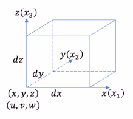
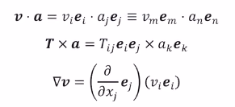
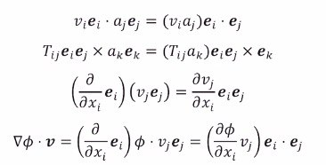
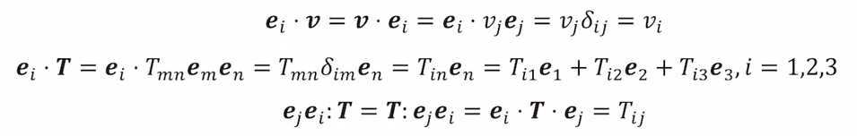
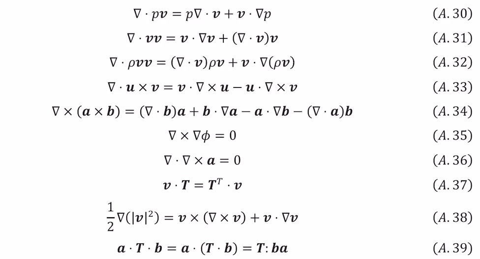
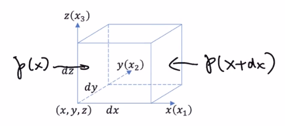

来自于b站视频：[BV1p7411r7SN](https://www.bilibili.com/video/BV1p7411r7SN/)
## ch. 0流体力学简介

### 力学

流体受到的力：

1. 质量力/体力：均匀施加于流体整体的力，一般只有重力。广义的质量力包括**合外力**，即牛二的$ma$。假设有一个合外力的相反值，这种假想力得到的效果是使流体平衡，这种由合外力等效得到的假想外力称为**惯性力**（达朗贝尔力）。同时人们也用“惯性力”表示合外力的大小。

2. 表面力：施加在流体表面上的力。比如流体质点的表面力来自于与之毗邻的流体质点对它的作用，是流体内力，表示了该点的应力状态，因此可以说流体质点的表面力即是**应力**（即单位面积上的内力）。

   应力可分为**正应力**与**切应力**：前者垂直于表面，后者相切或平行于表面。

### 流体

流体分子：纳米（$10^{-9} m$）

宏观尺寸：至少毫米（$10^{-3} m$）

引入微米（$10^{-6}m$），它有很多分子但是又比宏观小，就可以视为**流体质点**，它不考虑流体分子之间的空隙，但相对于宏观也可以视为体积无限小的质点，然后就可以认为流体是连续介质。

对流体质点的“标准微分体积”：选取左下前角作为(x, y, z)，认为流体质点的体积是$\mathrm dx\times \mathrm dy \times \mathrm dz$

两种流体模型：

- 理想（ideal）流体/无粘（non-viscous）流体：没有内摩擦的流体，所以对于理想流体，移动流体容器的边界或流体的某一部分并不会引起流体其他部分的运动。
  - 完全气体（perfect gas）：满足完全气体状态方程的物质，即$pV=n\bar RT$。完全气体并非理想流体（见2.2节）。
- 牛顿流体：恒定粘度的流体，满足牛顿流体本构方程的流体（见2.2节）。

量纲（加粗表示向量，不加粗表示标量）：

- 位置或位移：$\boldsymbol{x} = (x,y,z)\equiv(x_1,x_2,x_3) \;\;[L]$

- 时间或时刻：$t\;\;[T]$

- 流速：$\boldsymbol v = (u,v,w) \equiv (v_1, v_2, v_3) \;\; [\dfrac{L}{T}]$

- 密度：$\rho \equiv \lim\limits_{\Delta V \to 0} \dfrac{\Delta m}{\Delta V} \;\; [\dfrac{M}{L^3}]$

- 动力粘度($\mu$)与运动粘度($\upsilon$)：$[\dfrac{M}{LT}]$和$[\dfrac{L^2}{T}]$

- 压强：$p\;\;[\dfrac{F}{L^2} = \dfrac{M}{LT^2}]$

- 应力（stress）：$\sigma = \lim\limits_{\Delta A\to 0}\dfrac{\Delta F}{\Delta A}\;\;[\dfrac{F}{L^2} = \dfrac{M}{LT^2}]$

  应力与压强的区别：压强是单位面积上受到**压力**的大小，而应力是表面上各方向的受力大小。可以把表面的合力按法向切向分为正应力和切应力研究，前者如果与表面法向相反的话就是压强，所以说可以说压强是一种特殊的应力——压应力。

任意属性$b$的时空分布称为“场”：
$$
b = b(\boldsymbol x,t) = b(x,y,z,t)
$$
$b$包括速度、压强、密度、粘度等。

## 附录A 张量简介

### 张量表示

0阶张量——标量、1阶张量——向量、2阶张量

在三维空间中，$N$阶张量需要$3^N$个组分描述，零阶张量需要1个组分，一阶张量需要3个组分，二阶张量需要9个组分。一个组分就是一个标量。

一阶张量的3个组分：
$$
\boldsymbol v = (v_1,v_2,v_3)
$$
二阶张量的9个组分：
$$
\boldsymbol T = \left(
\begin{array}{ccc}
T_{11} & T_{12} & T_{13}\\
T_{21} & T_{22} & T_{23}\\
T_{31} & T_{32} & T_{33}
\end{array}
\right)
$$

自由指标：在公式中只出现一次的下标；重复指标：在公式中出现两次的下标。假设$[\boldsymbol e_1,\boldsymbol e_2,\boldsymbol e_3]$是一组单位正交基（每个基底都是一个三维向量，一组基底就是$3*3$矩阵），如果是重复指标则把所有指标可走的结果求和，因此在公式$\boldsymbol T = T_{ij}\boldsymbol e_i\boldsymbol e_j$中，$i,j$都是重复指标，因此把$i,j$都从1到3走一遍再求和，即$\boldsymbol T = T_{11}\boldsymbol e_1\boldsymbol e_1 + T_{12}\boldsymbol e_1\boldsymbol e_2 + \cdots + T_{33}\boldsymbol e_3\boldsymbol e_3$，其中张量积$\boldsymbol e_i \boldsymbol e_j$计算得到的结果是：一个3*3的矩阵，仅在$(i,j)$为1其余为0，这可以看下文张量积的定义

另外$\nabla$符号也可以用重复指标表示：$\nabla = (\dfrac{\part}{\part x},\dfrac{\part}{\part y},\dfrac{\part}{\part z}) = \dfrac{\part}{\part x_i}\boldsymbol e_i$，它也是一个一阶张量

标量用不加粗的字母表示：$\rho,\mu,\upsilon$；向量用加粗的小写英文字母表示：$\boldsymbol {a,v,e_j}$；二阶张量用加粗大写字母或希腊字母表示：$\boldsymbol {T,\sigma,\tau}$

### 张量的运算法则

一共有三种相关的乘法，从上到下分别是：点乘、叉乘、张量积（点乘、叉乘中的$v_m\boldsymbol e_m, T_{ij}\boldsymbol e_i \boldsymbol e_j$这些也是张量积：零阶张量和一阶张量的张量积，零阶张量、一阶张量和一阶张量的张量积）。张量积的计算优先级高于另外两个，因此在点乘叉乘左右两边的式子不用加括号，而第三个求梯度由于$\nabla$和$\boldsymbol v$之间也是张量积，所以$\nabla$和$\boldsymbol v$写成张量积的形式后需要加括号。

一阶、二阶张量之间乘法的步骤：

1. 将张量拆分成组分乘以基向量的形式，如$\boldsymbol a = a_i \boldsymbol e_i,\boldsymbol T = T_{ij}\boldsymbol e_i\boldsymbol e_j$，注意重复指标出现次数不能超过两次，因此不同张量的重复指标不能重复：$\boldsymbol T\times\boldsymbol a = T_{ij}\boldsymbol e_i \boldsymbol e_j\times a_k \boldsymbol e_k$

2. 将组分（即标量部分）进行代数相乘，余下一串全部由基向量组成的乘法，例：

   

   对于第四个式子，还需要注意的是如果有$\nabla$则它只作用在其后的第一个组分上。

3. 计算张量的基向量部分的乘法：分为点乘、叉乘、张量积的情况

   - 点乘

     a. 两个一阶张量（向量）点乘，由于在第一步已经把所有张量拆成了标量\*互相正交的基向量的形式，所以正交的基向量乘起来比较简单：
     $$
     \boldsymbol e_i\cdot\boldsymbol e_j = \delta_{ij} = 
     \left\{
     \begin{array}{}
     1,i=j\\
     0,i\ne j
     \end{array}
     \right.
     $$
     两个一阶张量的点乘满足交换律。
     
     b. 一、二阶张量点乘，也由于基向量的相交性会比较简单：
     $$
     \boldsymbol e_i\cdot\boldsymbol e_j\boldsymbol e_k = \delta_{ij}\boldsymbol e_k\\
     \boldsymbol e_i\boldsymbol e_j\cdot\boldsymbol e_k = \delta_{jk}\boldsymbol e_i
     $$
     c. 两个二阶张量点乘：
     
     - 一次点乘：
       $$
       \begin{array}{l}
       \boldsymbol A\cdot\boldsymbol B & = A_{ij}\boldsymbol e_i\boldsymbol e_j\cdot B_{mn}\boldsymbol e_m\boldsymbol e_n \\
       &= A_{ij}B_{mn}\boldsymbol e_i\boldsymbol e_j\cdot \boldsymbol e_m\boldsymbol e_n \\
       &= A_{ij}B_{mn}\delta_{jm}\boldsymbol e_i\boldsymbol e_n \\
       &= A_{ij}B_{jn}\boldsymbol e_i\boldsymbol e_n
       \end{array}
       $$
       结果中的张量积就无法再化简了
     
     - 二次点乘：（老师的意思是二次点乘就是在一次点乘的基础上再对张量积$\boldsymbol e_i\boldsymbol e_n$做一次点乘，感觉好......非数学的定义）
       $$
       \begin{array}{l}
       \boldsymbol A:\boldsymbol B &= A_{ij}B_{jn}\boldsymbol e_i\cdot\boldsymbol e_n\\
       &= A_{ij}B_{jn}\delta_{in}\\
       &= A_{ij}B_{ji}
       \end{array}
       $$
       
       一个很简介的结果。两个二阶张量的二次点乘满足交换律，$\boldsymbol A:\boldsymbol B = \boldsymbol B:\boldsymbol A$
     
     一次点乘消耗两个基向量，所以$m$阶张量与$n$阶张量在一次点乘后得到的张量阶数即为$m+n-2$
     
     一些例子（第二个式子最后一步就是把重复指标$n$按爱因斯坦求和形式展开了）：
     
     
     
     
     
   - 叉乘，流体力学中只会用到两个向量的叉乘
     $$
     \boldsymbol e_i\times\boldsymbol e_j = \epsilon_{ijk}\boldsymbol e_k,\;\text{where}
     \;\epsilon_{ijk} = 
     \left\{
     \begin{array}{l}
     0\;\;i=j \; \text{or}\;j=k \; \text{or}\;k=i \\
     1\;\;i,j,k顺时针排列,即123,231,312\\
     -1\;\;i,j,k逆时针排列,即321,213,132
     \end{array}
     \right.
     $$
   
     $$
     \boldsymbol a\times\boldsymbol b = a_ib_j\boldsymbol e_i\times\boldsymbol e_j = \epsilon_{ijk}a_ib_j\boldsymbol e_k
     $$
   
     置换符号$\epsilon_{ijk}$具有轮换对称性：$\epsilon_{ijk} = \epsilon_{kij} = \epsilon_{jki} = -\epsilon_{kji} = -\epsilon_{jik} = -\epsilon_{ikj}$ 
   
   - 张量积（tenson product）， 如$\boldsymbol T = T_{ij}\boldsymbol e_i \boldsymbol e_j$，其中张量积部分的计算方法是：
   
     假设$a_i = [a_1\;a_2\;a_3],b_j = [b_1\;b_2\;b_3]$
     $$
     \boldsymbol a_i \boldsymbol b_j = 
     \left[
     \begin{array}{l}
     a_1b_1 & a_1b_2 & a_1b_3\\
     a_2b_1 & a_2b_2 & a_2b_3\\
     a_3b_1 & a_2b_2 & a_3b_3
     \end{array}
     \right]
     $$
     因此$\boldsymbol T =T_{ij}\boldsymbol e_i \boldsymbol e_j = T_{11}\boldsymbol e_1\boldsymbol e_1 + T_{12}\boldsymbol e_1\boldsymbol e_2 + \cdots + T_{33}\boldsymbol e_3\boldsymbol e_3$中的$\boldsymbol e_i \boldsymbol e_j$得到的结果是：一个3*3的矩阵，仅在$(i,j)$为1，其余为0。
   

### $\nabla$算子作用于张量

$\nabla$用基向量表示：$\nabla = \dfrac{\part}{\part x_i}\boldsymbol e_i$（注意重复指标意味着求和，也即$\nabla =  \dfrac{\part}{\part x_1}\boldsymbol e_1 +  \dfrac{\part}{\part x_2}\boldsymbol e_2 +  \dfrac{\part}{\part x_3}\boldsymbol e_3 = \left(\dfrac{\part}{\part x}, \dfrac{\part}{\part y}, \dfrac{\part}{\part z}\right)$

1. $\nabla$与张量做张量积->梯度

   与零阶张量做张量积：$\text{grad} \;p = \nabla p = \dfrac{\part p}{\part x_i}\boldsymbol e_i$，注意$\dfrac{\part}{\part x_i}$的分子的空位只放遇到的第一个组分

   与一阶张量做张量积：$\text{grad} \; \boldsymbol u = \nabla \boldsymbol u = \dfrac{\part }{\part x_i}\boldsymbol e_i u_j\boldsymbol e_j = \dfrac{\part u_j}{\part x_i}\boldsymbol e_i\boldsymbol e_j$

   总结：求梯度/做张量积会让张量的阶数升一阶

2. $\nabla$与张量做点乘->散度，注意这会让张量降一阶，所以不能对零阶张量求散度

   对一阶张量求散度：$\text{div}\;\boldsymbol u = \nabla\cdot\boldsymbol u = \dfrac{\part}{\part x_i}\boldsymbol e_i\cdot u_j\boldsymbol e_j = \dfrac{\part u_j}{\part x_i}\boldsymbol e_i\cdot\boldsymbol e_j = \dfrac{\part u_j}{\part x_i}\delta_{ij} = \dfrac{\part u_i}{\part x_i}$

   对二阶张量求散度：$\text{div}\;\boldsymbol T = \nabla\cdot\boldsymbol T = \dfrac{\part}{\part x_i}\boldsymbol e_i\cdot T_{jk}\boldsymbol e_j\boldsymbol e_k = \dfrac{\part T_{jk}}{\part x_i}\boldsymbol e_i\cdot\boldsymbol e_j\boldsymbol e_k = \dfrac{\part T_{jk}}{\part x_i}\delta_{ij}\boldsymbol e_k = \dfrac{\part T_{ik}}{\part x_i}\boldsymbol e_k= \dfrac{\part T_{ij}}{\part x_i}\boldsymbol e_j$

3. $\nabla$与张量做叉乘->旋度，对张量求旋度保持同阶

   流体力学中只研究对一阶张量的旋度：$\text{curl}\;\boldsymbol u = \nabla\times \boldsymbol u =  \dfrac{\part}{\part x_i}\boldsymbol e_i\times u_j\boldsymbol e_j =  \dfrac{\part u_j}{\part x_i}\epsilon_{ijk}\boldsymbol e_k$

4. 先求梯度再求散度->拉普拉斯算子，先升一阶再降一阶，所以最后张量保持同阶

   对零阶张量求拉普拉斯：$\nabla\cdot\nabla p = \nabla^2 p = \dfrac{\part}{\part x_i}\boldsymbol e_i\cdot \dfrac{\part}{\part x_j}\boldsymbol e_j p = \dfrac{\part^2p}{\part x_i \part x_j}\delta_{ij} = \dfrac{\part^2p}{\part x_i\part x_i}$

   对一阶张量求拉普拉斯：$\nabla\cdot\nabla \boldsymbol u = \nabla^2 \boldsymbol u = \dfrac{\part}{\part x_i}\boldsymbol e_i\cdot \dfrac{\part}{\part x_j}\boldsymbol e_j u_k\boldsymbol e_k = \dfrac{\part^2u_k}{\part x_i \part x_j}\delta_{ij}\boldsymbol e_k = \dfrac{\part^2u_k}{\part x_i\part x_i}\boldsymbol e_k$

   可以写成$\dfrac{\part^2}{\part x_i^2}$，但这样会忘了$i$是一个表示求和的重复指标

单位张量：
$$
\boldsymbol I = \boldsymbol e_i\boldsymbol e_i = \boldsymbol e_1\boldsymbol e_1 + \boldsymbol e_2\boldsymbol e_2 +\boldsymbol e_3\boldsymbol e_3 = 
\left(
\begin{array}{}
1&0&0\\
0&1&0\\
0&0&1
\end{array}
\right)
$$
注意复习[张量积](#张量积的运算)的运算方式。

张量的转置（一般只会用到二阶张量的转置）：定义二阶张量$\boldsymbol T$的转置为$\boldsymbol T^\top$，则它们的组分关系满足：
$$
T^\top_{ij} = \boldsymbol e_j\boldsymbol e_i:\boldsymbol T^\top = \boldsymbol e_i\boldsymbol e_j:\boldsymbol T = T_{ji}
$$
这个式子说明的事情是，二阶转置张量有如下性质：$\boldsymbol T^\top$的$(i,j)$组分等于$\boldsymbol T$的$(j,i)$组分。其中$T^\top_{ij} = \boldsymbol e_j\boldsymbol e_i:\boldsymbol T^\top$见例子中的[第三个式子](#1)，为什么有$\boldsymbol e_j\boldsymbol e_i:\boldsymbol T^\top = \boldsymbol e_i\boldsymbol e_j:\boldsymbol T$成立呢？

对称张量：满足$\boldsymbol T^\top = \boldsymbol T$，即$T_{ij} = T_{ji}$的张量，如2.2节的应力张量。

反对称张量：满足$\boldsymbol T^\top = -\boldsymbol T$，即$T_{ij} + T_{ji} = 0$的张量，反对称张量的对角线元素必为0, 因为$T_{ii} + T_{ii} = 0\Rightarrow T_{ii} = 0$.

### 常用的$\nabla$与张量的计算性质

摆了，以后用到和需要知道证明时去看P9、P10

## ch. 1水静力学

研究静止时的流体->没有形变->没有切应力，流体只受重力和正应力/压强（注意应力的量纲是$[\dfrac{F}{L^2} = \dfrac{M}{LT^2}]$，同压强而不是压力）

由一顿微分推导可以得出：在流体静止，即只收到正应力的情况下，一个看作质点的流体中某点的正应力大小与取向无关，或称此时的正应力是**各向同性**的。称此时正应力的负值为压强$p$。

总结：一个静止的流体质点在任何方向受到的正应力都是一样的。

### 水静力学基本方程

我们研究静止的流体质点的受力，先以x方向为例，记左右面受到的平均压强分别为$p(x),p(x+\mathrm dx)$，则x方向上受到的合力为：
$$
p(x)\mathrm dy\mathrm dz - p(x+\mathrm dx)\mathrm dy\mathrm dz
$$
除以微分体积$\mathrm dV=\mathrm dx\mathrm dy\mathrm dz$，得到x方向的压力造成的单位体积受力大小为：
$$
\lim\limits_{\mathrm dx\to0}\dfrac{p(x)-p(x+\mathrm dx)}{\mathrm dx} = -\dfrac{\part p}{\part x}
$$
同理可得y, z方向单位体积受到的压强合力大小为$-\dfrac{\part p}{\part y}, -\dfrac{\part p}{\part z}$，因此压力总合力为：
$$
-\dfrac{\part p}{\part x_1}\boldsymbol e_1-\dfrac{\part p}{\part x_2}\boldsymbol e_2-\dfrac{\part p}{\part x_3}\boldsymbol e_3 = -\nabla p
$$
由于流体质点处于平衡状态，合压力与重力抵消，因此得到**水静力学基本方程**（用两种方式书写，合力的方式和各个方向上重复指标的方式）：
$$
-\nabla p + \rho \boldsymbol g = 0\\
\dfrac{\part p}{\part x_i} = \rho g_i
$$
其中$g_i$为重力加速度$\boldsymbol g$在$\boldsymbol e_i$方向的分量。

如果$\boldsymbol e_1, \boldsymbol e_2$为水平方向，$\boldsymbol e_3$竖直向上，那么$\boldsymbol g = [0, 0, -g]$，则水静力学基本方程可以简化为（也是最常用的形式）：
$$
\dfrac{\mathrm dp}{\mathrm dz} = -\rho g
$$
### 浮力

